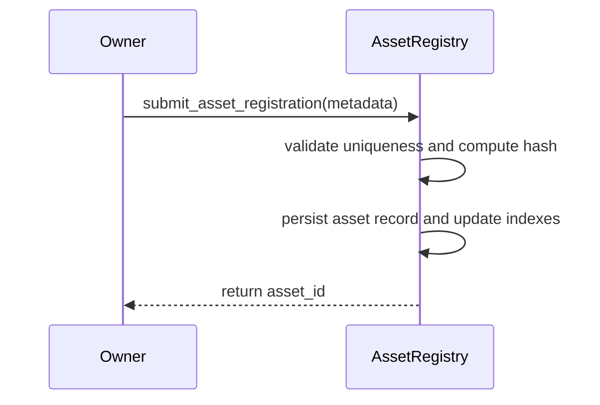
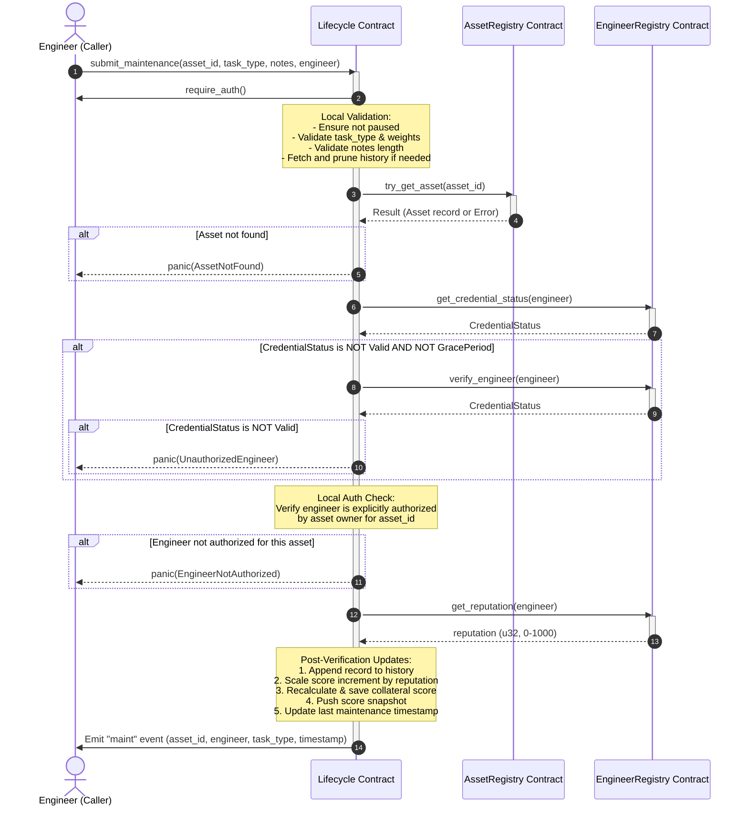
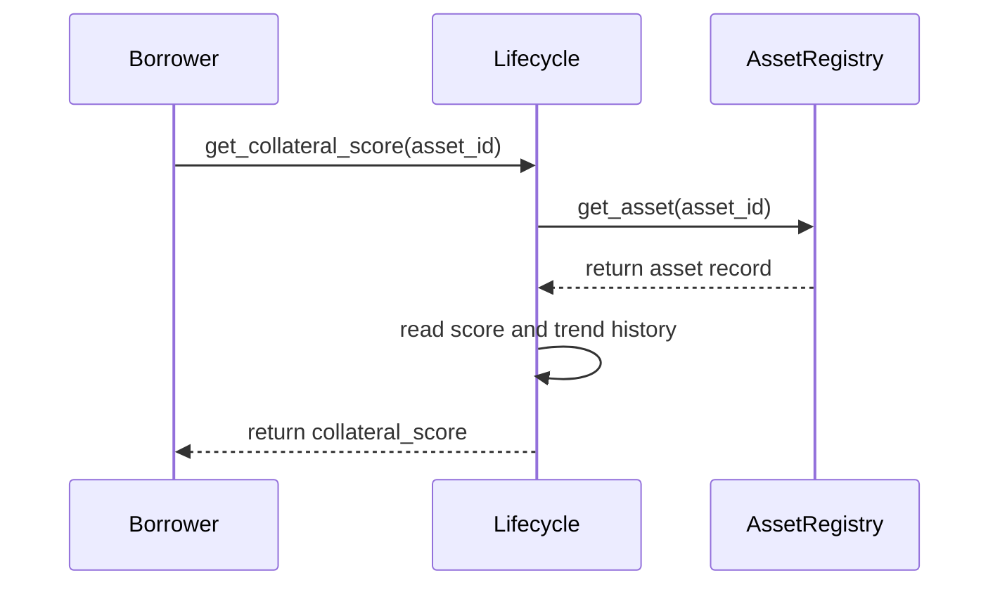

# Architecture Overview

Mainstay is composed of three independent Soroban smart contracts deployed on the Stellar network. Each contract owns a distinct domain and exposes a minimal public interface. The Lifecycle contract is the only contract that makes cross-contract calls — to the other two.

---

## Contracts

### AssetRegistry

Maintains the canonical registry of industrial assets.

**Responsibilities:**
- Register assets with a unique sequential ID (`asset_count` counter)
- Store asset metadata (type, owner, registration timestamp)
- Enforce per-owner deduplication via SHA-256 hash of metadata
- Track owner → asset ID index for reverse lookups
- Support ownership transfer and metadata updates
- Admin-gated upgrade path

**Key storage:**
| Key | Type | Description |
|-----|------|-------------|
| `(ASSET, id)` | `Asset` | Asset record |
| `(DEDUP, owner, hash)` | `u64` | Dedup guard → asset ID |
| `(OWN_IDX, owner)` | `Vec<u64>` | Owner's asset IDs |
| `A_COUNT` | `u64` | Monotonic asset ID counter |

---

### EngineerRegistry

Manages engineer credentials issued by trusted issuers.

**Responsibilities:**
- Maintain a whitelist of trusted credential issuers (admin-managed)
- Allow trusted issuers to register engineers with a credential hash and validity period
- Expose `verify_engineer` — returns `true` only if the credential is active and not expired
- Support credential revocation by the original issuer
- Track issuer → engineer index

**Key storage:**
| Key | Type | Description |
|-----|------|-------------|
| `(ENG, address)` | `Engineer` | Credential record |
| `(TRUSTED, issuer)` | `bool` | Trusted issuer flag |
| `(ISS_ENGS, issuer)` | `Vec<Address>` | Issuer's engineers |

---

### Lifecycle

The orchestration contract. Binds AssetRegistry and EngineerRegistry together to produce a verifiable maintenance audit trail and collateral score for each asset.

**Responsibilities:**
- Accept maintenance submissions from engineers
- Cross-call AssetRegistry to confirm the asset exists
- Cross-call EngineerRegistry to confirm the engineer's credential is active
- Append immutable `MaintenanceRecord` entries to per-asset history (capped at `max_history`, default 200)
- Compute and update a collateral score (0–100) per asset based on task weights
- Record a `ScoreEntry` snapshot (timestamp + score) on every maintenance event
- Apply time-based score decay when `decay_score` is called
- Expose score trend queries (`get_score_trend`, `get_score_history`)
- Admin-gated configuration updates (score increment, decay rate/interval) and upgrade path

**Task weight table:**
| Tasks | Points |
|-------|--------|
| `OIL_CHG`, `LUBE`, `INSPECT` | 2 |
| `FILTER`, `TUNE_UP`, `BRAKE` | 5 |
| `ENGINE`, `OVERHAUL`, `REBUILD` | 10 |
| (any other) | 3 |

**Key storage:**
| Key | Type | Description |
|-----|------|-------------|
| `(HIST, asset_id)` | `Vec<MaintenanceRecord>` | Full maintenance history |
| `(SCORE, asset_id)` | `u32` | Current collateral score |
| `(SCHIST, asset_id)` | `Vec<ScoreEntry>` | Score snapshots over time |
| `(LUPD, asset_id)` | `u64` | Timestamp of last maintenance |
| `CONFIG` | `Config` | Admin, scoring, and decay config |
| `REGISTRY` | `Address` | Bound AssetRegistry address |
| `ENG_REG` | `Address` | Bound EngineerRegistry address |

---

## Cross-Contract Call Flow

The Lifecycle contract acts as the main orchestrator and is the only contract that initiates cross-contract calls. Neither `AssetRegistry` nor `EngineerRegistry` calls any other contract.

### Cross-Contract Call Mapping

| Calling Contract | Calling Function | Target Contract | Target Function | Purpose |
|------------------|-------------------|-----------------|-----------------|---------|
| `Lifecycle` | `submit_maintenance` / `batch_submit_maintenance` | `AssetRegistry` | `try_get_asset` | Verifies that the asset exists. Panics with `AssetNotFound` if it does not. |
| `Lifecycle` | `submit_maintenance` / `batch_submit_maintenance` | `EngineerRegistry` | `get_credential_status` | Retrieves the engineer's credential status. |
| `Lifecycle` | `submit_maintenance` / `batch_submit_maintenance` | `EngineerRegistry` | `verify_engineer` | Fallback check called if the status from `get_credential_status` is not `Valid` or `GracePeriod`. Panics with `UnauthorizedEngineer` if verification fails. |
| `Lifecycle` | `submit_maintenance` / `batch_submit_maintenance` | `EngineerRegistry` | `get_reputation` | Fetches the engineer's reputation score to weight the collateral score increment. |
| `Lifecycle` | `record_transfer` | `AssetRegistry` | `try_get_asset` | Verifies that the asset exists. |
| `Lifecycle` | `record_transfer` | `AssetRegistry` | `get_asset` | Fetches the asset to verify that the `new_owner` matches the current owner in the registry. Panics with `UnauthorizedOwner` if they do not match. |
| `Lifecycle` | `get_collateral_score` / `get_collateral_score_batch` | `AssetRegistry` | `try_get_asset` | Verifies that the asset exists. |
| `Lifecycle` | `get_collateral_score` / `get_collateral_score_batch` | `AssetRegistry` | `get_asset` | Fetches the asset to verify that its deprecation status is `Active` (deprecated assets return `0` immediately). |

---

## Sequence Diagrams

### Asset Registration Flow

### Maintenance Submission Flow

### DeFi Collateral Query Flow

---

## Deployment & Initialization

Each contract is deployed independently. After deployment:

1. **AssetRegistry** — call `initialize_admin(admin)`
2. **EngineerRegistry** — call `initialize_admin(admin)`, then `add_trusted_issuer(admin, issuer)`
3. **Lifecycle** — call `initialize(asset_registry_address, engineer_registry_address, admin, max_history)`

The Lifecycle contract stores the addresses of the other two contracts at initialization time. These addresses are immutable after initialization.

---

## TTL Strategy

All three contracts use Soroban persistent storage and extend TTL by 518,400 ledgers (~30 days) on every write. See [ttl-strategy.md](ttl-strategy.md) for full details.

---

## Further Reading

- [Life-Cycle Contract Design](lifecycle-contract.md)
- [Engineer Credentialing](credentialing.md)
- [Collateral Scoring Model](collateral-scoring.md)
- [TTL Strategy](ttl-strategy.md)
- [Threat Model & Security](threat-model.md)
